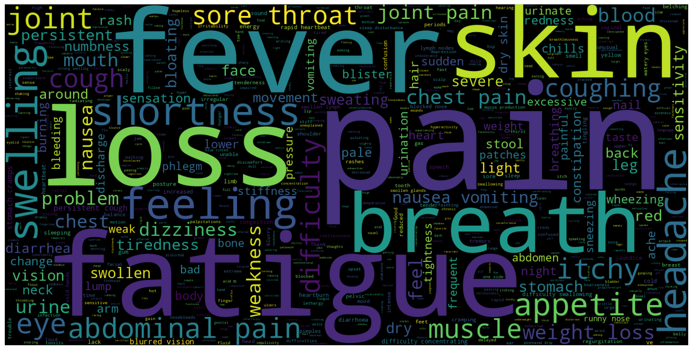
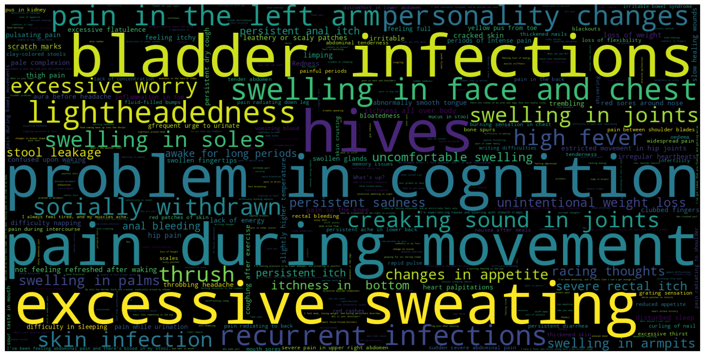

# 🏥 Medical Chatbot – Disease Diagnosis System

> **DEPI Graduation Project** — An AI-powered symptom-to-diagnosis chatbot built with machine learning classification models.

---

## 📌 Overview

This project is an intelligent medical chatbot that enables patients to describe their symptoms in natural language and receive a probable disease diagnosis. The system was trained on a structured healthcare intents dataset and achieves **74.14% diagnostic accuracy** across multiple disease categories.

---

## ✨ Features

- 🤖 **Conversational Interface** — Chat-based UI for seamless patient interaction
- 🧠 **ML-Powered Diagnosis** — Trained classification model predicts disease from symptoms
- 📊 **Multi-class Support** — Covers a wide range of disease categories
- ⚡ **Real-time Responses** — Flask backend processes and returns predictions instantly
- 🔤 **NLP Feature Extraction** — TF-IDF vectorization for symptom text understanding

---

## 🗂️ Project Structure

```
medical-chatbot/
│
├── app.py                  # Flask web application entry point
├── dataset/
│   └── intents.json        # Healthcare intents (symptoms, tags, responses)
├── model/
│   ├── chatbot_model.pkl   # Trained ML classification model
│   └── vectorizer.pkl      # Fitted TF-IDF vectorizer
├── templates/
│   └── index1.html         # Chatbot frontend UI
└── HealthCare_Notebook_Updated.ipynb  # Full training & EDA notebook
```

---

## 🔬 Dataset & EDA

The dataset consists of structured intents mapping patient symptom descriptions to disease tags and appropriate responses.

**Most Common Symptoms (Word Cloud)**



**Least Common Symptoms (Word Cloud)**



---

## 🏗️ System Architecture

```
User Input (Symptoms)
        ↓
  Text Preprocessing
        ↓
  TF-IDF Vectorization
        ↓
  ML Classification Model
        ↓
  Predicted Disease Tag
        ↓
  Response Lookup (intents.json)
        ↓
  Chatbot Response → User
```

---

## ⚙️ Installation & Setup

### Prerequisites

- Python 3.8+
- pip

### 1. Clone the Repository

```bash
git clone https://github.com/your-username/medical-chatbot.git
cd medical-chatbot
```

### 2. Install Dependencies

```bash
pip install -r requirements.txt
```

### 3. Run the Application

```bash
python app.py
```

Then open your browser and navigate to `http://127.0.0.1:5000/`

---

## 📦 Dependencies

| Package | Purpose |
|--------|---------|
| `Flask` | Web framework & REST API |
| `scikit-learn` | ML model training & TF-IDF vectorization |
| `pickle` | Model serialization |
| `numpy` / `pandas` | Data manipulation |
| `matplotlib` / `wordcloud` | Visualization & EDA |

---

## 🤖 Model Details

| Attribute | Value |
|-----------|-------|
| Model Type | ML Classifier (Best-selected) |
| Feature Extraction | TF-IDF Vectorizer |
| Accuracy | **74.14%** |
| Task | Multi-class Intent Classification |
| Training Data | Healthcare intents (symptoms → disease tags) |

---

## 🚀 API Endpoints

| Method | Endpoint | Description |
|--------|----------|-------------|
| `GET` | `/` | Renders the chatbot UI |
| `POST` | `/chat` | Accepts user symptom input, returns diagnosis response |

### Example Request

```bash
curl -X POST http://127.0.0.1:5000/chat \
     -d "user_input=I have a high fever and sore throat"
```

---

## 📈 Results

- Achieved **74.14% diagnostic accuracy** across multiple disease categories
- Built an end-to-end pipeline from raw symptom text to final diagnosis
- Successfully deployed as a conversational web interface

---

## 👥 Team

**DEPI Graduation Project**

---

## 📄 License

This project is developed for academic and educational purposes as part of the DEPI Graduation Program.

---

## ⚠️ Disclaimer

This chatbot is intended for **educational and research purposes only**. It is **not a substitute for professional medical advice, diagnosis, or treatment**. Always consult a qualified healthcare provider for medical concerns.
